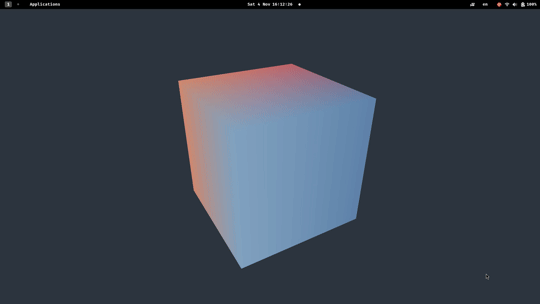

# X11 Desktop Cube with OpenGL

## Description

This is a simple example of an X11 `_NET_WM_WINDOW_TYPE_DESKTOP` window with an OpenGL context. It creates an effect of drawing graphics directly onto the desktop. It works on **X11** and **Wayland** (via *XWayland* compatibility layer).

## Demo




## Dependencies

Ensure you have the `OpenGL development libraries` installed. These may be provided by Mesa or by proprietary drivers, such as those from NVIDIA or AMD. In many cases, these libraries will already be installed on your system.

#### Arch Linux/Manjaro:
```bash
sudo pacman -S glew libx11 libxinerama
```
#### Debian/Ubuntu:
```bash
sudo apt-get install libglew-dev libx11-dev libxinerama-dev
```
#### Fedora:
```bash
sudo dnf install glew-devel libX11-devel libXinerama-devel
```

## Compilation

Use the provided `Makefile` to build the project and optionally install it (installation assumes you are running systemd):

```bash
git clone https://github.com/michaelknap/x11-desktop-cube-example
cd x11-desktop-cube-example
make
./build/desktop_cube
make install (optional install)
# If systemd:
systemctl --user start desktop_cube.service # OR
systemctl --user enable desktop_cube.service
```

## Note on OpenGL Usage

For the sake of simplicity and brevity, this demo utilizes the fixed-function pipeline elements of OpenGL. Those looking to adapt or expand upon this code might consider updating to a more modern, shader-based approach.

## Known Limitations

- While the demo should work with basic multi-screen setups, it might not render correctly in configurations where monitors are stacked or vary in size.


## License

This project is licensed under the [MIT License](LICENSE).